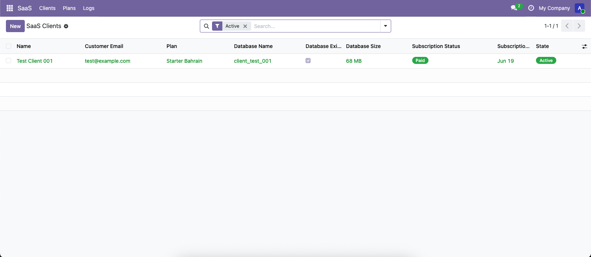
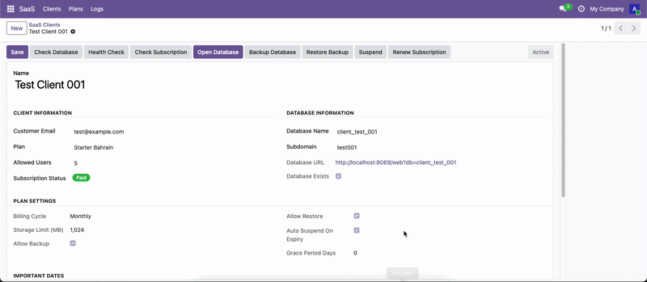
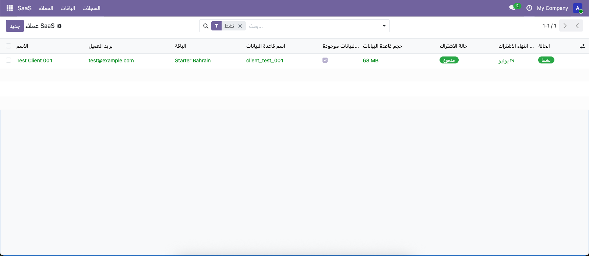
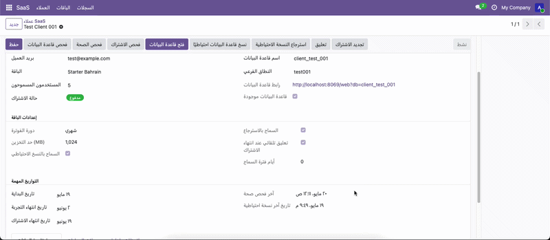

# SaaS Manager for Odoo 19

<div align="center">


<br />


**A custom open-source Odoo 19 module for managing SaaS clients, plans, databases, subscriptions, backups, restores, health checks, and operation logs.**

**موديول مفتوح المصدر مخصص لـ Odoo 19 لإدارة عملاء SaaS، الباقات، قواعد البيانات، الاشتراكات، النسخ الاحتياطي، الاسترجاع، الفحص، وسجلات العمليات.**

[Features](#main-features) • [Screenshots](#screenshots) • [Installation](#installation) • [Arabic](#العربية) • [License](#license)

</div>

---

## English

### Overview

`saas` is a custom **Odoo 19** module designed to manage SaaS client databases from inside Odoo. It allows an administrator to create client databases from a template database, check database status, open databases, create backups, restore backups, suspend or activate databases, manage subscription status, and track every important operation through a dedicated logs model.

This module is useful for SaaS-style Odoo hosting where each client can have a separate database and a defined subscription plan.

> This repository is designed to be reusable by the community. Update paths and PostgreSQL settings according to your own environment before production use.

---

### Main Features

- Manage SaaS clients from Odoo.
- Manage SaaS plans with pricing, trial period, limits, and permissions.
- Create a client database from a template database.
- Check if a client database exists.
- Open a client database from the Odoo interface.
- Create PostgreSQL backups using `pg_dump`.
- Restore the last backup using `pg_restore`.
- Suspend and activate client databases.
- Renew, expire, cancel, and check subscriptions.
- Auto-check subscriptions using scheduled cron logic.
- Auto-suspend expired clients after a grace period.
- Store operation logs for admin tracking.
- Normalize Arabic/Persian digits for database-related fields.
- Support Arabic translation using `i18n/ar.po`.

---

### Screenshots

#### English Interface




#### Arabic Interface





---

### Module Structure

```text
saas/
├── __init__.py
├── __manifest__.py
├── LICENSE
├── README.md
├── data/
├── docs/
│   └── images/
│       ├── odoosaaslogo.png
│       ├── odooAR.png
│       ├── odooEN.png
│       ├── odoosaasAR.gif
│       └── odoosaasEN.gif
├── i18n/
│   └── ar.po
├── models/
│   ├── __init__.py
│   ├── saas_client.py
│   ├── saas_plan.py
│   └── saas_log.py
├── security/
│   └── ir.model.access.csv
└── views/
    ├── menu.xml
    ├── saas_client_views.xml
    ├── saas_plan_views.xml
    └── saas_log_views.xml
```

---

### Models Explained

#### `saas.plan`

The `saas.plan` model defines the subscription plans available for SaaS clients.

Main fields:

| Field | Description |
|---|---|
| `name` | Plan name. |
| `code` | Internal plan code. |
| `monthly_price` | Monthly price of the plan. |
| `billing_cycle` | Billing cycle: monthly, quarterly, or yearly. |
| `trial_days` | Number of trial days given to new clients. |
| `template_database` | Existing PostgreSQL/Odoo database used as a template. |
| `max_users` | Maximum allowed users for the client. |
| `storage_limit_mb` | Storage limit in MB. |
| `allow_backup` | Controls whether this plan can create backups. |
| `allow_restore` | Controls whether this plan can restore backups. |
| `auto_suspend_on_expiry` | Automatically suspend expired clients. |
| `grace_period_days` | Extra days before auto-suspension after expiry. |
| `active` | Enables or disables the plan. |
| `description` | Optional plan description. |

Important methods:

| Method | Description |
|---|---|
| `_convert_arabic_digits()` | Converts Arabic/Persian digits to English digits. |
| `_normalize_digit_fields()` | Normalizes digit-based fields before saving. |
| `create()` | Normalizes values before creating a record. |
| `write()` | Normalizes values before updating a record. |
| `action_save_record()` | Shows a success notification. |

---

#### `saas.client`

The `saas.client` model is the main model of the module. It represents a SaaS customer and their database.

Main fields:

| Field | Description |
|---|---|
| `name` | Client name. |
| `customer_email` | Client email address. |
| `plan_id` | Related SaaS plan. |
| `database_name` | Client database name. |
| `subdomain` | Optional subdomain for the client. |
| `start_date` | Subscription start date. |
| `trial_end_date` | Trial end date. |
| `subscription_end_date` | Paid subscription end date. |
| `subscription_state` | Trial, paid, expired, or cancelled. |
| `allowed_users` | Number of users allowed for the client. |
| `state` | Database state: draft, creating, active, error, suspended. |
| `database_url` | Computed URL to open the database. |
| `database_exists` | Stores whether the database exists. |
| `database_size` | Stores the database size. |
| `last_health_check` | Last health check datetime. |
| `health_message` | Last health check message. |
| `backup_path` | Last backup file path. |
| `backup_date` | Last backup datetime. |
| `error_message` | Stores the latest error message. |
| `log_ids` | Related operation logs. |

Related plan fields displayed on the client:

| Field | Source |
|---|---|
| `billing_cycle` | Related from `plan_id.billing_cycle`. |
| `storage_limit_mb` | Related from `plan_id.storage_limit_mb`. |
| `allow_backup` | Related from `plan_id.allow_backup`. |
| `allow_restore` | Related from `plan_id.allow_restore`. |
| `auto_suspend_on_expiry` | Related from `plan_id.auto_suspend_on_expiry`. |
| `grace_period_days` | Related from `plan_id.grace_period_days`. |

Important methods:

| Method | Description |
|---|---|
| `_notify()` | Shows a notification in the Odoo UI. |
| `_log_operation()` | Creates a record in `saas.log`. |
| `_database_exists()` | Checks if a PostgreSQL database exists. |
| `_get_database_size()` | Gets the database size from PostgreSQL. |
| `_terminate_database_connections()` | Terminates active connections before restore or template copy. |
| `_create_database_from_template()` | Creates a new database using a template database. |
| `action_create_database()` | Creates the client database. |
| `action_check_database()` | Checks whether the database exists. |
| `action_open_database()` | Opens the database in a new browser tab. |
| `action_backup_database()` | Creates a backup file using `pg_dump`. |
| `action_restore_last_backup()` | Restores the latest saved backup using `pg_restore`. |
| `action_suspend_database()` | Suspends an active client database. |
| `action_activate_database()` | Activates a suspended client database. |
| `action_renew_subscription()` | Renews subscription. |
| `action_check_subscription()` | Checks whether the subscription is valid or expired. |
| `action_mark_subscription_expired()` | Manually marks subscription as expired. |
| `action_cancel_subscription()` | Cancels subscription and suspends active database. |
| `action_health_check()` | Checks database existence and size. |
| `_cron_check_subscriptions()` | Scheduled logic for checking expired subscriptions. |

---

#### `saas.log`

The `saas.log` model stores operation history for important SaaS actions.

Main fields:

| Field | Description |
|---|---|
| `log_date` | Related to `create_date`. |
| `client_id` | Related SaaS client. |
| `database_name` | Database name involved in the operation. |
| `operation` | Operation type. |
| `status` | Success, warning, or failed. |
| `message` | Operation message. |
| `user_id` | User who triggered the operation. |

Supported operations:

- Create Database
- Check Database
- Restore Database
- Health Check
- Open Database
- Backup Database
- Suspend Database
- Activate Database
- Renew Subscription
- Check Subscription
- Error

---

### Requirements

- Odoo 19
- Python 3.12+
- PostgreSQL
- PostgreSQL client tools available in the server environment:
  - `psql`
  - `createdb`
  - `pg_dump`
  - `pg_restore`
- A configured Odoo custom addons path
- A PostgreSQL user with permission to create, inspect, backup, and restore databases


---

### Installation

Clone the repository into your custom addons directory:

```bash
cd /path/to/custom-addons
git clone https://github.com/HMA202/odoo-saas.git saas
```

Activate your Odoo virtual environment:

```bash
cd /path/to/odoo
source /path/to/venv/bin/activate
```

Update your Odoo configuration and make sure `addons_path` includes your custom addons directory:

```ini
addons_path = /path/to/odoo/addons,/path/to/custom-addons
```

Update the module:

```bash
./odoo-bin -c /path/to/odoo.conf -u saas -d your_database_name
```

Run Odoo normally:

```bash
./odoo-bin -c /path/to/odoo.conf -d your_database_name
```

---

### Deployment Notes

On a production server:

```bash
cd /path/to/custom-addons
git clone https://github.com/HMA202/odoo-saas.git saas
```

Then update the module:

```bash
cd /path/to/odoo
source /path/to/venv/bin/activate
./odoo-bin -c /path/to/odoo.conf -u saas -d your_database_name
```

Restart Odoo if it is running as a service:

```bash
sudo systemctl restart odoo
```

---

### Important Notes

- Do not push this module inside the official Odoo source repository.
- Keep this module as a separate Git repository.
- Make sure the Odoo config includes the custom addons path.
- Make sure PostgreSQL tools are available in the server environment.
- Make sure the Odoo user has permission to run PostgreSQL commands.
- Keep backups outside the Git repository.
- Keep secrets and environment variables out of Git.
- Review and test the module carefully before using it in production.

---

## العربية

### نظرة عامة

`saas` هو موديول مفتوح المصدر مخصص لـ **Odoo 19** لإدارة عملاء SaaS وقواعد بياناتهم من داخل أودو. يتيح للمدير إنشاء قاعدة بيانات للعميل من قاعدة بيانات قالب، فحص حالة قاعدة البيانات، فتح قاعدة العميل، إنشاء نسخة احتياطية، استرجاع النسخة الاحتياطية، تعليق أو تفعيل قاعدة البيانات، إدارة حالة الاشتراك، وتسجيل كل عملية مهمة في سجل خاص.

هذا الموديول مناسب لفكرة استضافة Odoo بنظام SaaS، بحيث يمكن أن يكون لكل عميل قاعدة بيانات مستقلة وباقة اشتراك محددة.

> تم تجهيز هذا المشروع ليكون عامًا وقابلًا لإعادة الاستخدام. عدّل المسارات وإعدادات PostgreSQL حسب بيئتك قبل استخدامه في الإنتاج.

---

### المميزات الرئيسية

- إدارة عملاء SaaS من داخل Odoo.
- إدارة الباقات والأسعار وفترة التجربة والحدود والصلاحيات.
- إنشاء قاعدة بيانات للعميل من قاعدة بيانات قالب.
- فحص وجود قاعدة بيانات العميل.
- فتح قاعدة بيانات العميل من واجهة Odoo.
- إنشاء نسخة احتياطية باستخدام `pg_dump`.
- استرجاع آخر نسخة احتياطية باستخدام `pg_restore`.
- تعليق وتفعيل قواعد بيانات العملاء.
- تجديد، إلغاء، إنهاء، وفحص الاشتراكات.
- فحص الاشتراكات بشكل تلقائي عبر منطق مجدول.
- تعليق العميل تلقائيًا بعد انتهاء فترة السماح.
- تسجيل العمليات في سجل إداري واضح.
- تحويل الأرقام العربية والفارسية إلى أرقام إنجليزية في الحقول المهمة.
- دعم الترجمة العربية من خلال ملف `i18n/ar.po`.

---

### الصور والعروض

#### الواجهة الإنجليزية


#### الواجهة العربية


---

### هيكل الموديول

```text
saas/
├── __init__.py
├── __manifest__.py
├── LICENSE
├── README.md
├── data/
├── docs/
│   └── images/
│       ├── odoosaaslogo.png
│       ├── odooAR.png
│       ├── odooEN.png
│       ├── odoosaasAR.gif
│       └── odoosaasEN.gif
├── i18n/
│   └── ar.po
├── models/
│   ├── __init__.py
│   ├── saas_client.py
│   ├── saas_plan.py
│   └── saas_log.py
├── security/
│   └── ir.model.access.csv
└── views/
    ├── menu.xml
    ├── saas_client_views.xml
    ├── saas_plan_views.xml
    └── saas_log_views.xml
```

---

### شرح المودلز

#### `saas.plan`

موديل `saas.plan` مسؤول عن تعريف باقات الاشتراك المتاحة للعملاء.

أهم الحقول:

| الحقل | الوصف |
|---|---|
| `name` | اسم الباقة. |
| `code` | كود داخلي للباقة. |
| `monthly_price` | السعر الشهري للباقة. |
| `billing_cycle` | دورة الدفع: شهري، ربع سنوي، سنوي. |
| `trial_days` | عدد أيام الفترة التجريبية. |
| `template_database` | قاعدة بيانات Odoo موجودة يتم استخدامها كقالب. |
| `max_users` | الحد الأقصى للمستخدمين. |
| `storage_limit_mb` | حد التخزين بالميجابايت. |
| `allow_backup` | السماح بإنشاء نسخة احتياطية. |
| `allow_restore` | السماح باسترجاع نسخة احتياطية. |
| `auto_suspend_on_expiry` | تعليق العميل تلقائيًا بعد انتهاء الاشتراك. |
| `grace_period_days` | عدد أيام السماح بعد انتهاء الاشتراك. |
| `active` | تفعيل أو تعطيل الباقة. |
| `description` | وصف اختياري للباقة. |

أهم الدوال:

| الدالة | الوصف |
|---|---|
| `_convert_arabic_digits()` | تحويل الأرقام العربية والفارسية إلى إنجليزية. |
| `_normalize_digit_fields()` | تنظيف الحقول قبل الحفظ. |
| `create()` | تنظيف البيانات قبل إنشاء السجل. |
| `write()` | تنظيف البيانات قبل تعديل السجل. |
| `action_save_record()` | عرض إشعار نجاح في واجهة Odoo. |

---

#### `saas.client`

موديل `saas.client` هو الموديل الأساسي في النظام، ويمثل العميل وقاعدة بياناته.

أهم الحقول:

| الحقل | الوصف |
|---|---|
| `name` | اسم العميل. |
| `customer_email` | بريد العميل. |
| `plan_id` | الباقة المرتبطة بالعميل. |
| `database_name` | اسم قاعدة بيانات العميل. |
| `subdomain` | الدومين الفرعي للعميل إن وجد. |
| `start_date` | تاريخ بداية الاشتراك. |
| `trial_end_date` | تاريخ انتهاء الفترة التجريبية. |
| `subscription_end_date` | تاريخ انتهاء الاشتراك المدفوع. |
| `subscription_state` | حالة الاشتراك: تجربة، مدفوع، منتهي، ملغي. |
| `allowed_users` | عدد المستخدمين المسموح لهم. |
| `state` | حالة قاعدة البيانات: مسودة، قيد الإنشاء، نشطة، خطأ، معلقة. |
| `database_url` | رابط محسوب لفتح قاعدة البيانات. |
| `database_exists` | يوضح إذا كانت قاعدة البيانات موجودة. |
| `database_size` | حجم قاعدة البيانات. |
| `last_health_check` | آخر وقت تم فيه فحص الصحة. |
| `health_message` | رسالة آخر فحص صحة. |
| `backup_path` | مسار آخر نسخة احتياطية. |
| `backup_date` | تاريخ آخر نسخة احتياطية. |
| `error_message` | آخر رسالة خطأ. |
| `log_ids` | سجلات العمليات المرتبطة بالعميل. |

حقول مرتبطة من الباقة:

| الحقل | المصدر |
|---|---|
| `billing_cycle` | من `plan_id.billing_cycle`. |
| `storage_limit_mb` | من `plan_id.storage_limit_mb`. |
| `allow_backup` | من `plan_id.allow_backup`. |
| `allow_restore` | من `plan_id.allow_restore`. |
| `auto_suspend_on_expiry` | من `plan_id.auto_suspend_on_expiry`. |
| `grace_period_days` | من `plan_id.grace_period_days`. |

أهم الدوال:

| الدالة | الوصف |
|---|---|
| `_notify()` | عرض إشعار في واجهة Odoo. |
| `_log_operation()` | إنشاء سجل في `saas.log`. |
| `_database_exists()` | فحص وجود قاعدة بيانات PostgreSQL. |
| `_get_database_size()` | جلب حجم قاعدة البيانات من PostgreSQL. |
| `_terminate_database_connections()` | إيقاف الاتصالات المفتوحة قبل النسخ أو الاسترجاع. |
| `_create_database_from_template()` | إنشاء قاعدة بيانات جديدة من قالب. |
| `action_create_database()` | إنشاء قاعدة بيانات العميل. |
| `action_check_database()` | فحص وجود قاعدة البيانات. |
| `action_open_database()` | فتح قاعدة البيانات في تبويب جديد. |
| `action_backup_database()` | إنشاء نسخة احتياطية باستخدام `pg_dump`. |
| `action_restore_last_backup()` | استرجاع آخر نسخة احتياطية باستخدام `pg_restore`. |
| `action_suspend_database()` | تعليق قاعدة بيانات نشطة. |
| `action_activate_database()` | تفعيل قاعدة بيانات معلقة. |
| `action_renew_subscription()` | تجديد الاشتراك. |
| `action_check_subscription()` | فحص حالة الاشتراك. |
| `action_mark_subscription_expired()` | جعل الاشتراك منتهي يدويًا. |
| `action_cancel_subscription()` | إلغاء الاشتراك وتعليق القاعدة إذا كانت نشطة. |
| `action_health_check()` | فحص وجود القاعدة وحجمها. |
| `_cron_check_subscriptions()` | منطق مجدول لفحص الاشتراكات المنتهية. |

---

#### `saas.log`

موديل `saas.log` مسؤول عن تخزين تاريخ العمليات التي تحدث على العملاء وقواعد البيانات.

أهم الحقول:

| الحقل | الوصف |
|---|---|
| `log_date` | مرتبط بـ `create_date`. |
| `client_id` | العميل المرتبط بالسجل. |
| `database_name` | اسم قاعدة البيانات المرتبطة بالعملية. |
| `operation` | نوع العملية. |
| `status` | الحالة: نجاح، تحذير، فشل. |
| `message` | رسالة العملية. |
| `user_id` | المستخدم الذي نفذ العملية. |

أنواع العمليات المدعومة:

- إنشاء قاعدة البيانات
- فحص قاعدة البيانات
- استرجاع قاعدة البيانات
- فحص الصحة
- فتح قاعدة البيانات
- النسخ الاحتياطي
- تعليق قاعدة البيانات
- تفعيل قاعدة البيانات
- تجديد الاشتراك
- فحص الاشتراك
- خطأ

---

### المتطلبات

- Odoo 19
- Python 3.12 أو أحدث
- PostgreSQL
- توفر أدوات PostgreSQL في بيئة السيرفر:
  - `psql`
  - `createdb`
  - `pg_dump`
  - `pg_restore`
- تفعيل مسار الإضافات المخصصة في إعدادات Odoo
- مستخدم PostgreSQL لديه صلاحية إنشاء وفحص ونسخ واسترجاع قواعد البيانات

---

### التثبيت

انسخ المشروع داخل مجلد الإضافات المخصصة:

```bash
cd /path/to/custom-addons
git clone https://github.com/HMA202/odoo-saas.git saas
```

فعّل البيئة الافتراضية:

```bash
cd /path/to/odoo
source /path/to/venv/bin/activate
```

تأكد أن ملف إعدادات Odoo يحتوي على مسار الإضافات المخصصة:

```ini
addons_path = /path/to/odoo/addons,/path/to/custom-addons
```

حدّث الموديول:

```bash
./odoo-bin -c /path/to/odoo.conf -u saas -d your_database_name
```

شغّل Odoo بشكل طبيعي:

```bash
./odoo-bin -c /path/to/odoo.conf -d your_database_name
```

---

### ملاحظات النشر

على السيرفر:

```bash
cd /path/to/custom-addons
git clone https://github.com/HMA202/odoo-saas.git saas
```

ثم تحديث الموديول:

```bash
cd /path/to/odoo
source /path/to/venv/bin/activate
./odoo-bin -c /path/to/odoo.conf -u saas -d your_database_name
```

إذا كان Odoo يعمل كخدمة:

```bash
sudo systemctl restart odoo
```

---

### ملاحظات مهمة

- لا ترفع الموديول داخل سورس Odoo الرسمي.
- الأفضل أن يكون الموديول repository مستقل.
- تأكد أن `addons_path` في ملف إعدادات Odoo يحتوي على مسار `custom-addons`.
- تأكد من توفر أدوات PostgreSQL في بيئة السيرفر.
- تأكد أن مستخدم Odoo لديه صلاحية تنفيذ أوامر PostgreSQL المطلوبة.
- لا ترفع النسخ الاحتياطية إلى Git.
- لا ترفع كلمات المرور أو ملفات البيئة إلى Git.
- اختبر الموديول جيدًا قبل استخدامه في الإنتاج.

---

## License

This project is licensed under the LGPL-3 License.

---

## الترخيص

هذا المشروع مرخّص تحت رخصة LGPL-3.

---

## Author

Developed by [**Habib Mohammed**](https://github.com/HMA202).

